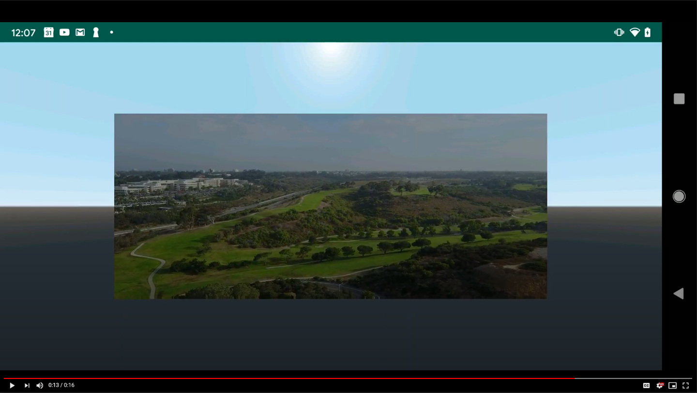

# GAST-Video Plugin

[](https://drive.google.com/file/d/1EivylJMbkO9GymIkv8D25vOIxNevDT2C/view?usp=sharing "mp4 video playback in Godot on an Android device")

This is a Godot Android plugin which enables video playback for all codecs supported by the target platform within Godot games / apps.

**Note:** This plugin is only supported on the Godot **3.2.x** branch, starting with **version 3.2.2**.

## Getting the plugin

Plugin binaries and dependencies can be found in the [project releases section](https://github.com/m4gr3d/GAST/releases).

### Installation

- To install into the project, follow the [instructions for loading and using an Android plugin](https://docs.godotengine.org/en/stable/tutorials/plugins/android/android_plugin.html#loading-and-using-an-android-plugin).
- In the Godot Android export presets window, enable the **Gast-video** and **Gast-core** plugins listed under the **Plugins** section.

### Usage

Follow these instructions in order to use the plugin in your code:

1. In `_ready()`, load and initialize the `GastLoader` native script:
   - ```
     var gast_loader

     func _ready():
        ...
        gast_loader = load("res://godot/plugin/v1/gast/GastLoader.gdns").new()
        gast_loader.initialize()
        ...
     ```
2. Then retrieve and setup the `gast-video` plugin in `_ready()`:
   - ```
     func _ready():
        ...
        if Engine.has_singleton("gast-video"):
           var gast_video_plugin = Engine.get_singleton("gast-video")
           gast_video_plugin.preparePlayer("/root/Spatial/VideoContainer", ["flight"])
           gast_video_plugin.play()
           gast_video_plugin.setVideoScreenSize(3, 2)
        ...
     ```
3. In `_process(delta)`, make sure to invoke `GastLoader::on_process()` method:
   - ```
     func _process(delta):
        ...
        gast_loader.on_process()
        ...
     ```

Refer to the [Plugin API](#plugin-apis) section to find out more about the plugin set of functionality.

## Plugin APIs

The following APIs are exposed by the plugin:

### Player Setup APIs
- `preparePlayer(parentNodePath: String, videoRawNames: Array) -> void`:
  - Setup the player to use for media playback. Invoking this method is required prior to using the player for media playback.
  - `@param[parentNodePath]` Node path for the node that should contain the player.
  - `@param[videoRawNames]` Names of the media files used for playback.
    - For now, the media files should be lower case with no spaces, be located in the project's
    raw resources directory and the file extension should be omitted (e.g: `res/raw/flight.mp4` -> `["flight"]`).
- `setVideoScreenCollidable(collidable: bool) -> void`:
  - Enable / disable collision with the player screen.
  - `@param[collidable]` True to enable collision, false otherwise.
- `setVideoScreenCurved(curved: bool) -> void`:
  - Enable / disable curving of the player screen.
  - `@param[curved]` True to curve the player screen, false otherwise.
- `setVideoScreenSize(width: float, height:float) -> void`:
  - Update the player screen size.
  - `@param[width]` Width of the player screen.
  - `@param[height]` Height of the player screen.

### Media Playback APIs
- `play() -> void`:
  - Resume media playback if paused or stopped.
- `isPlaying() -> bool`
  - `@return` True if the player is setup and media is playing, false otherwise.
- `pause() -> void`
  - Pause media playback.
- `seekTo(positionInMsec: int) -> void`
  - Seeks to a position specified in milliseconds.
  - `@param[positionInMsec]` The seek position to target.
- `stop() -> void`
  - Stop playback.
- `setRepeatMode() -> void`
  - Repeat mode for media playback.
  - `@param[repeatMode]` Should be one of:
    - REPEAT_MODE_OFF = 0; Normal playback without repetition.
    - REPEAT_MODE_ONE = 1; "Repeat One" mode to repeat the currently playing media infinitely.
    - REPEAT_MODE_ALL = 2; "Repeat All" mode to repeat the entire timeline infinitely.

### Player Input APIs

See the [Collision Events](../../../../../../../../../../README.md#collision-events) documentation in the top `README` for
information on how to setup input handling for the Gast-Video plugin.

## Samples

Example code and sample projects can be found under the [`samples`](../../../../../../../../../../samples) directory:

- [Plugin demo](../../../../../../../../../../samples/video_demo)
